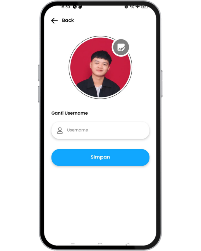

# 🐖 Aplikasi Pencatatan Celengan Digital untuk Mengelola dan Memonitor Target Tabungan Secara Praktis, Offline dan Online

Aplikasi pencatatan celengan digital berbasis **React Native**. Aplikasi ini dirancang untuk membantu pengguna mencatat target tabungan mereka dan memantau pencapaiannya. Mendukung mode offline dan integrasi dengan Firebase.

---

## 📱 Fitur Utama

- **🏠 Tab Home**  
  Menampilkan daftar celengan yang sedang berjalan atau aktif.

- **🏆 Tab Tercapai**  
  Menampilkan daftar catatan celengan yang telah berhasil dicapai.

- **🔐 Autentikasi Pengguna**  
  Tersedia fitur login dan register menggunakan Firebase

- **👤 Halaman Profil**  
  Menampilkan data pengguna yang sedang login.

- **📴 Dukungan Offline**  
  Menggunakan SQLite untuk menyimpan data secara lokal saat tidak terhubung ke internet.


---

## 🛠️ Teknologi yang Digunakan

- [React Native](https://reactnative.dev/)
- [Firebase](https://firebase.google.com/docs)
- [SQLite](https://docs.expo.dev/versions/latest/sdk/sqlite/) (via Expo)
- [async-storage](https://reactnative.dev/docs/asyncstorage)
- [Expo](https://expo.dev/) 

---

## 🚧 Status Proyek

🚧 **Dalam Pengembangan**  
Proyek ini masih dalam tahap pengembangan. Beberapa fitur masih dapat berubah atau ditingkatkan di masa mendatang.

---

---

## Tampilan Halaman 
### 1. **Halaman loading saat aplikasi di buka.**
<div align="left">
  
</div>

### 2. **Halaman Home** 
<div align="left">
  
</div>

### 3. **Halaman Add Tabungan**
  - Form untuk gambar
      - Gambar bisa diambil dari kamera atau galery
      - Form Target Tabungan
      - Batas Tabungan 999.999.999
  - Form Mata Uang
      - **IDR** (Rupiah) — Indonesia  
      - **USD** (US Dollar) — United States  
      - **EUR** (Euro) — Germany, France, Italy, Spain, Netherlands, Portugal  
      - **GBP** (Pound Sterling) — United Kingdom  
      - **JPY** (Yen) — Japan  
      - **THB** (Baht) — Thailand  
      - **MYR** (Ringgit) — Malaysia  
      - **SGD** (Singapore Dollar) — Singapore  
      - **VND** (Dong) — Vietnam  
      - **PHP** (Philippine Peso) — Philippines
  - Form Estimasi Pengisian (Harian, Mingguan, Bulanan)
      - Disediakan fitur untuk menghitung waktu yg dibutuhkan agar target tercapai.

<div align="left">
  
</div>

### 4. **Halaman Detail Tabungan & Setoran**
  - Fitur Edit dan Delete
  - Fitur Tambah Setoran
      - Tambah Setoran tidak bisa lebih dari target
  - Fitur Kurang Setoran
      - Kurang Setoran tidak bisa kurang dari tabungan/setoran yg sudah di tambahkan
<div align="left">
  
  
  
</div>

### 5. **Halaman Complate**
  - Berisi Informasi Tabungan yang sudah selesai
<div align="left">
  
</div>

### 6. **Halaman Complate Details**
  - Berisi Informasi Tabungan & Setoran
  - Berisi Informasi tanggal mulai dan selesai
<div align="left">
  
</div>

### 7. **Halaman Register**
  - Menggunakan Username Uniqe
<div align="left">
  
</div>

### 8. **Halaman Login**
<div align="left">
  
</div>

### 8. **Halaman Profile**
  - Fitur Tambah Foto
  - Fitur Edit Username (Uniqe)
<div align="left">
  
</div>

### 8. **Modal Profile**
 - Tombol Login & Logout
<div align="left">
  
</div>
---

##  Demo Aplikasi

Ini adalah demo video aplikasi “Catatan Celengan”:

[Tonton Demo Video Di Google Drive](https://drive.google.com/file/d/1GXLht18_CnECcDsOpecsFhWy7di2zp_Q/view?usp=sharing)


## ⚙️ Instalasi dan Menjalankan Aplikasi

1. **Clone repository**
   ```bash
   git clone https://github.com/username/nama-repo.git
   cd nama-repo

   #Install dependencies
   npm install
   # atau
   yarn

   # Jalankan aplikasi
   
   # Untuk pengguna React Native CLI:
   npx react-native run-android

   # Untuk pengguna Expo:
   npx expo start
   ```


# 🙋 Kontribusi

  - Pull Request sangat terbuka! Ikuti langkah berikut:
  - Fork repo ini
  - Buat branch fitur: git checkout -b fitur-baru
  - Commit: git commit -m "Tambah fitur"
  - Push: git push origin fitur-baru
  - Buka Pull Request ke repo utama

# 📬 Kontak 

📧 Email: ilhamm778866@gmail.com


# 📄 Lisensi
MIT License © 2025 Ilham Rohmatulloh


   
